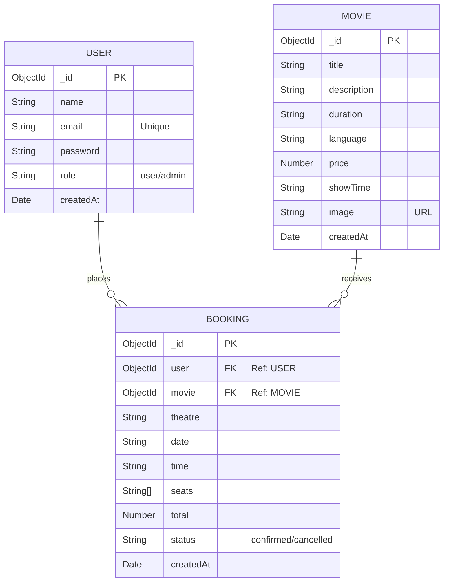
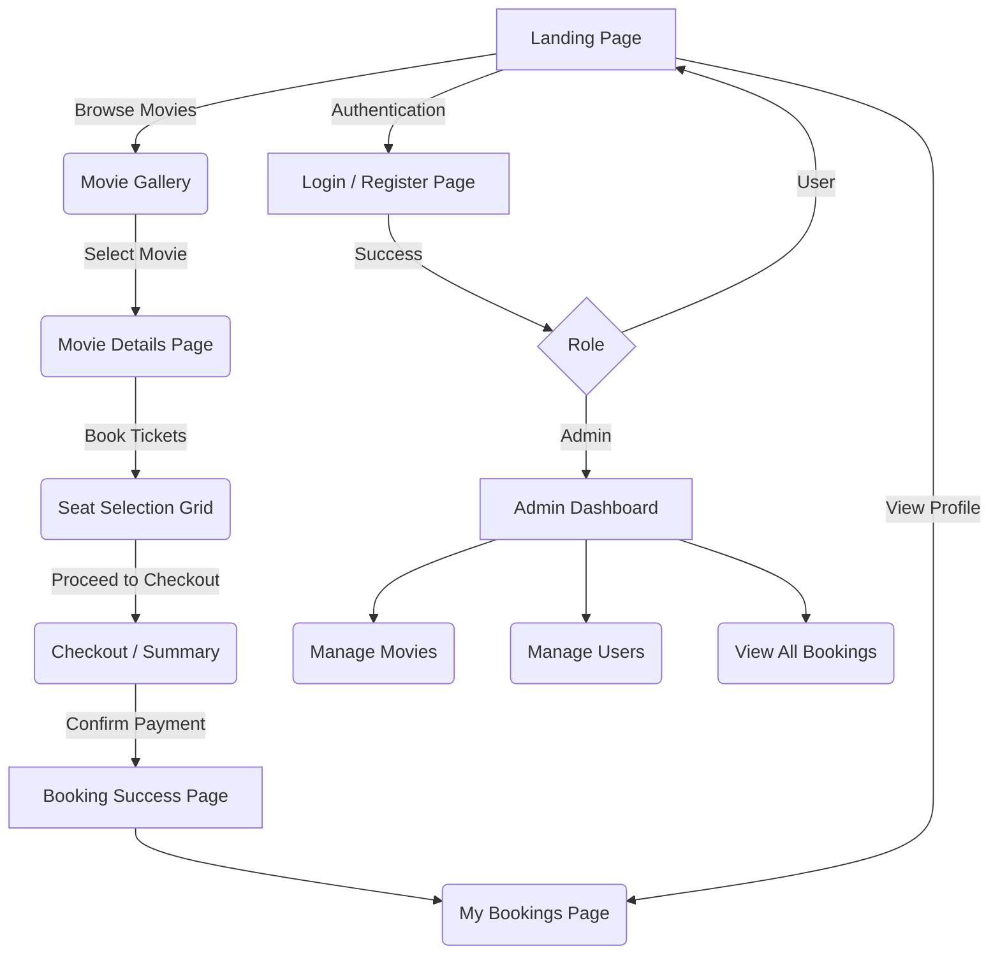

 Database Schema and Wireframes

1. Database Schema

The web application utilizes MongoDB for data storage, consisting of three primary collections: `User`, `Movie`, and `Booking`.

### Entity Relationship Diagram

 2. Wireframes Analysis

A. Home/Landing Page
* **Header:** Navigation Bar with Logo, Home, Movies, Login/Register (or User Profile if logged in).
* **Hero Section:** Promoted or top-rated movie carousel/banner.
* **Movie Grid:** Grid layout displaying movie posters, titles, and "Book Now" buttons.

 B. Movie Details & Booking Page
* **Top Header:** Navigation bar.
* **Movie Info:** Left-aligned movie poster, Right-aligned details (Title, Description, Duration, Language, Price, Showtimes).
* **Seat Map Interface:** A dynamic grid representing a theatre room.
  * Screen at the top.
  * Clickable seat icons changing color upon selection (Available, Selected, Booked).
* **Checkout Summary:** Dynamic calculation of total price based on selected seats. Action button to confirm booking.

 C. Admin Dashboard
* **Sidebar:** Links to Manage Movies, View Bookings, Users.
* **Main Screen:** Table displaying all movies with "Add Movie", "Edit", and "Delete" actions. Form modals for inputting new movie data.

## 3. User Navigation Flowchart
Here is the visual flow of the wireframe mapping across the web application:

